**STEP 1 – PREPARE NFS SERVER**

- Spin up a new EC2 instance with RHEL Linux 8 Operating System (3 webservers and 1 NFS server)
- Create a db server (ubuntu 20.04)
- Create 3 volume for the NFS server on aws and attach

2. ssh into the NFS machine and create our disk partition

- sudo gdisk /dev/xvdf /dev/xvdg /dev/xvdh

1. Install lvm pacakage

- sudo yum install lvm2 -y
- sudo lvmdiskan
- lsblk
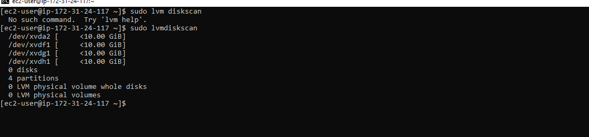

4. Create physical volume

- sudo pvcreate /dev/xvdf1
- sudo pvcreate /dev/xvdg1
- sudo pvcreate /dev/xvfh
- check sudo pvs
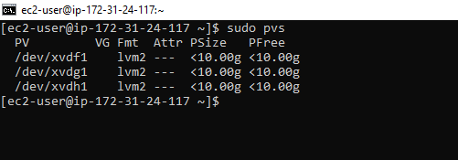

5. Create the Volume group

- sudo vgcreate webdata-vg /dev/xvdf1 /dev/xvdg1 /dev/xvdh1
- sudo vgs
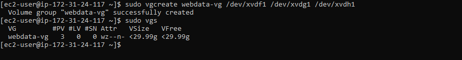

6. Create logical volumes (lv-apps,lv-logs and lv-opt)

- sudo lvcreate -n lv-apps -L 9G webdata-vg
- sudo lvcreate -n lv-logs-L 9G webdata-vg
- sudo lvcreate -n lv-opt-L 9G webdata-vg
- sudo lvs
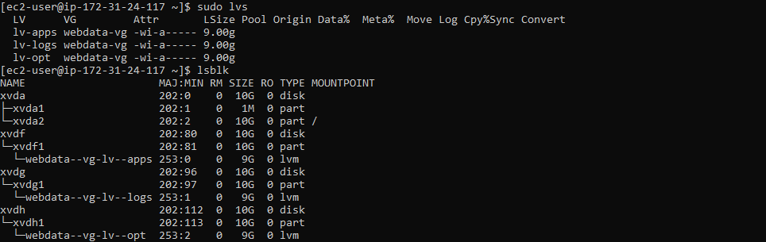

7. Format the disk to xfs format

- sudo mkfs -t  xfs /dev/webdata-vg/lv-apps
- sudo mkfs -t  xfs /dev/webdata-vg/lv-logs
- sudo mkfs -t  xfs /dev/webdata-vg/lv-opt

8. Create mount points /mnt directory for logical volumes

- sudo mkdir /mnt/apps
- sudo mkdir /mnt/logs
- sudo mkdir /mnt/opt

9. Mount our volume on the mount points

- sudo mount /dev/webdata-vg/lv-apps /mnt/apps
- sudo mount /dev/webdata-vg/lv-logs /mnt/logs
- sudo mount /dev/webdata-vg/lv-opt /mnt/opt
- lsblk
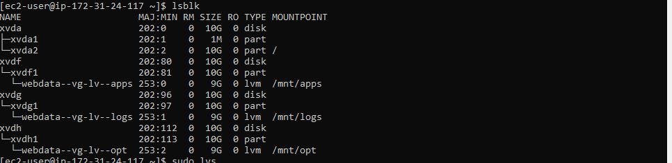

10. Install NFS server, configure it to set on reboot

- sudo yum -y update
- sudo yum install nfs-utils -y
- sudo systemctl start nfs-server.service
- sudo systemctl enable nfs-server.service
- sudo systemctl status nfs-server.service

11. Export the mounts for webservers’ subnet cidr to connect as clients. For simplicity, you will install your all three Web Servers inside the same subnet, but in production set up you would probably want to separate each tier inside its own subnet for higher level of security.
To check your subnet cidr – open your EC2 details in AWS web console and locate ‘Networking’ tab and open a Subnet link:

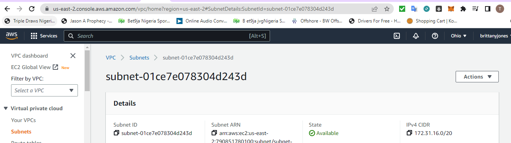

12. Make sure we set up permission that will allow our Web servers to read, write and execute files on NFS:

- sudo chown -R nobody: /mnt/apps
- sudo chown -R nobody: /mnt/logs
- sudo chown -R nobody: /mnt/opt

- sudo chmod -R 777 /mnt/apps
- sudo chmod -R 777 /mnt/logs
- sudo chmod -R 777 /mnt/opt

- sudo systemctl restart nfs-server.service

13. Configure access to NFS for clients within the same subnet (Subnet CIDR – 172.31.16.0/20 ):

- sudo vi /etc/exports
- /mnt/apps <Subnet-CIDR>(rw,sync,no_all_squash,no_root_squash)
/mnt/logs <Subnet-CIDR>(rw,sync,no_all_squash,no_root_squash)
/mnt/opt <Subnet-CIDR>(rw,sync,no_all_squash,no_root_squash)
- sudo exportfs -arv
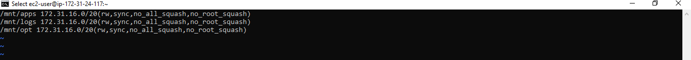

14. Check which port is used by NFS and open it using Security Groups (add new Inbound Rule)

- rpcinfo -p | grep nfs

15. In order for NFS server to be accessible from your client, you must also open following ports: TCP 111, UDP 111, UDP 2049, TCP 2049

- 

**STEP 2 — CONFIGURE THE DATABASE SERVER**

1. Install MySQL server

- Sudo apt update
- sudo apt install mysql-server -y

2. Create a database and name it tooling

- sudo mysql
- mysql> create databses;
- mysql>create user 'webaccess'@'172.31.16.0/20' identified by 'password';
- mysql> grant all privileges on tooling;
- mysql> flush privileges;
- mysql> show databases;
- mysql> use tooling;

**Step 3 — Prepare the Web Servers**
1.launch (webserver 1) with RHEL 8 operating system

2. Install NFS Client

- sudo yum install nfs-utils nfs4-acl-tools -y

3. Mount /var/www/ and target the NFS server’s export for apps

- sudo mkdir /var/www
- sudo mount -t nfs -o rw,nosuid NFS-Server-Private-IP-Address:/mnt/apps /var/www

4. Verify that NFS was mounted successfully by running df -h. Make sure that the changes will persist on Web Server after reboot:

- sudo vi /etc/fstab
- Add the following line
- NFS-Server-Private-IP-Address:/mnt/apps /var/www nfs defaults 0 0

5. Install apache and PHP

- sudo yum install httpd -y
  
  **Repeat steps 1-5 for another 2 Web Servers**

6. Verify that Apache files and directories are available on the Web Server in /var/www and also on the NFS server in /mnt/apps. If you see the same files – it means NFS is mounted correctly

- ls /var/www (on webserver1)
- ls /mnt/apps (on NFS server)
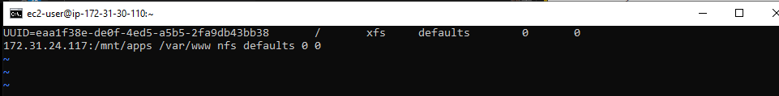

7. You can try to create a new file touch test.md from one server and check if the same file is accessible from other Web Servers.

- sudo touch /var/www/test.md (on webserver)

- ls /mnt/apps (on NFS server)

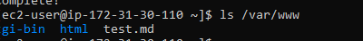

8. Locate the log folder for Apache on the Web Server and mount it to NFS server’s export for logs. Repeat step №4 to make sure the mount point will persist after reboot.

- sudo mount -t nfs o rw,nosuid NFS-PRIVATE-I.P:mnt/logs /var/log/httpd

9. Fork the github from darey repository

- sudo yum install git
- git init
- git clone <https://github.com/darey-io/tooling.git>
- ls
- cd tooling

10. Move the html file to /var/wwww/html

- sudo cp -R html/. /var/www/html
- ls /var/www/html
- ls html

11. Do not forget to open TCP port 80 on the Web Server.
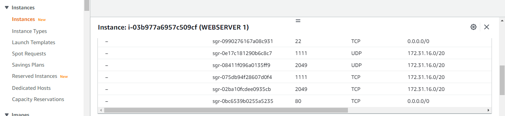

- If you encounter 403 Error check permissions to your /var/www/html folder and also disable SELinux
- cd ..
- sudo sentenforce 0
- To make this change permanent – open following config file
- sudo vi /etc/sysconfig/selinux
- sudo systemctl start httpd
- sudo systemctl status httpd

- Test webserver public i.p address

12. Update the website’s configuration to connect to the database (in /var/www/html/functions.php file).

- sudo vi /var/www/html/functions.php

13. On webserver Apply tooling-db.sql script to your database using this command

- cd tooling
- sudo yum install mysql -y
- mysql -h databse-private-ip-u webaccess -p tooling < tooling-db.sql

14. On db-server security group edit inbound rules, enable tcp port 3306

- sudo systemctl status mysql
- sudo vi /etc/mysql.conf.d/mysql.cnf
- Edit bind address
- 
- sudo systemctl restart mysql

15. Go back to our database server and enter the command

- sudo mysql
- mysql>show databases;
- mysql> use tooling;
- mysql> select * from users;

16. Remove the test page (ON WEBSERVER)

- ls /etc/httpd/conf.d/welcome.conf
- sudo mv /etc/httpd/conf.d/welcome.cnf /etc/httpd/conf.d/welcome.backup
- sudo systemctl restart httpd
- sudo systemctl status httpd
- check public i.p address on browser

17. We need to install some php dependecies in other to view our website

- sudo yum install <https://dl.fedoraproject.org/pub/epel/epel-release-latest-8.noarch.rpm>
- sudo yum install dnf-utils <http://rpms.remirepo.net/enterprise/remi-release-8.rpm>
- sudo yum module list php
- sudo yum module reset php
- sudo yum module enable php:remi-7.4
- sudo yum install php php-opcache php-gd php-curl php-mysqlnd
- sudo systemctl start php-fpm
- sudo systemctl enable php-fpm
- sudo setsebool -P httpd_execmem 1
- sudo systemctl restart httpd
- sudo systemctl status httpd

18. Open the website in your browser http://<Web-Server-Public-IP-Address-or-Public-DNS-Name>/index.php and make sure you can login into the websIte with myuser user.

**WEBSERVER 2**

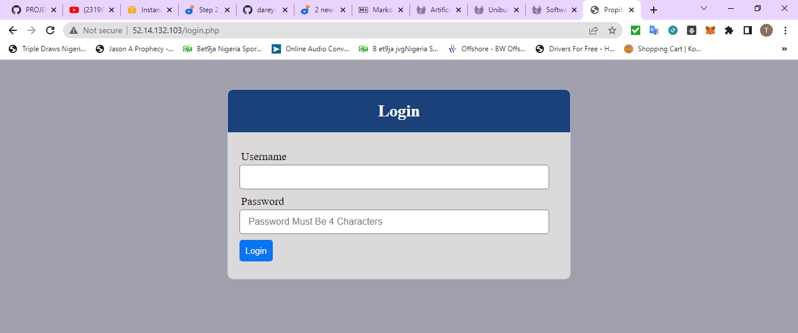

**WEBSERVER 3**

**Congratulations!**
You have just implemented a web solution for a DevOps team using LAMP stack with remote Database and NFS servers.
